# Diagrama de Relacionamento do Banco de Dados - Gestum

```mermaid
erDiagram
    %% ==========================================
    %% USUÁRIOS E EMPRESAS
    %% ==========================================

    users {
        bigint id PK
        string name
        string email UK
        string password
        timestamp email_verified_at
        bigint company_id FK
        timestamps created_at
        timestamps updated_at
    }

    companies {
        bigint id PK
        string name
        string document "CNPJ/CPF"
        string email
        string phone
        string address
        string city
        string state
        string zip_code
        timestamps created_at
        timestamps updated_at
    }

    %% ==========================================
    %% BANCOS E CONTAS
    %% ==========================================

    banks {
        bigint id PK
        string name
        string code "Código do banco"
        string icon
        boolean active
        timestamps created_at
        timestamps updated_at
    }

    bank_accounts {
        bigint id PK
        bigint company_id FK
        bigint bank_id FK
        string name
        string agency
        string account_number
        enum type "checking|savings|investment"
        decimal initial_balance
        decimal current_balance
        boolean active
        timestamps created_at
        timestamps updated_at
    }

    %% ==========================================
    %% CARTÕES DE CRÉDITO
    %% ==========================================

    credit_cards {
        bigint id PK
        bigint company_id FK
        bigint bank_account_id FK "Conta para pagamento"
        string name
        string last_digits
        decimal credit_limit
        integer closing_day "Dia fechamento"
        integer due_day "Dia vencimento"
        boolean active
        timestamps created_at
        timestamps updated_at
    }

    credit_card_invoices {
        bigint id PK
        bigint credit_card_id FK
        date reference_date
        date closing_date
        date due_date
        decimal amount
        enum status "open|closed|paid"
        timestamps created_at
        timestamps updated_at
    }

    %% ==========================================
    %% CATEGORIAS E CENTROS DE CUSTO
    %% ==========================================

    categories {
        bigint id PK
        bigint company_id FK
        bigint parent_id FK "Subcategorias"
        string name
        enum type "income|expense"
        string color
        string icon
        boolean active
        timestamps created_at
        timestamps updated_at
    }

    cost_centers {
        bigint id PK
        bigint company_id FK
        string name
        string description
        boolean active
        timestamps created_at
        timestamps updated_at
    }

    %% ==========================================
    %% CLIENTES E FORNECEDORES
    %% ==========================================

    clients {
        bigint id PK
        bigint company_id FK
        string name
        string document "CNPJ/CPF"
        string email
        string phone
        string address
        string city
        string state
        string zip_code
        text notes
        boolean active
        timestamps created_at
        timestamps updated_at
    }

    suppliers {
        bigint id PK
        bigint company_id FK
        string name
        string document "CNPJ/CPF"
        string email
        string phone
        string address
        string city
        string state
        string zip_code
        text notes
        boolean active
        timestamps created_at
        timestamps updated_at
    }

    %% ==========================================
    %% LANÇAMENTOS (CONTAS A PAGAR/RECEBER)
    %% ==========================================

    transactions {
        bigint id PK
        bigint company_id FK
        bigint category_id FK
        bigint bank_account_id FK
        bigint cost_center_id FK
        bigint client_id FK "Null se despesa"
        bigint supplier_id FK "Null se receita"
        bigint credit_card_invoice_id FK "Se cartão"
        bigint recurrence_id FK "Se recorrente"
        enum type "income|expense"
        string description
        decimal amount
        date due_date "Vencimento"
        date payment_date "Data pagamento"
        enum status "pending|paid|overdue|cancelled"
        text notes
        string attachment "Comprovante"
        timestamps created_at
        timestamps updated_at
    }

    %% ==========================================
    %% RECORRÊNCIAS
    %% ==========================================

    recurrences {
        bigint id PK
        bigint company_id FK
        bigint category_id FK
        bigint bank_account_id FK
        bigint cost_center_id FK
        bigint client_id FK
        bigint supplier_id FK
        enum type "income|expense"
        string description
        decimal amount
        integer day_of_month "Dia do vencimento"
        enum frequency "monthly|weekly|yearly"
        date start_date
        date end_date "Null = indefinido"
        boolean active
        timestamps created_at
        timestamps updated_at
    }

    %% ==========================================
    %% TRANSFERÊNCIAS
    %% ==========================================

    transfers {
        bigint id PK
        bigint company_id FK
        bigint from_account_id FK
        bigint to_account_id FK
        decimal amount
        date transfer_date
        text notes
        timestamps created_at
        timestamps updated_at
    }

    %% ==========================================
    %% ORÇAMENTO E METAS
    %% ==========================================

    budgets {
        bigint id PK
        bigint company_id FK
        bigint category_id FK
        integer year
        integer month
        decimal planned_amount
        timestamps created_at
        timestamps updated_at
    }

    goals {
        bigint id PK
        bigint company_id FK
        bigint bank_account_id FK "Conta destino"
        string name
        decimal target_amount
        decimal current_amount
        date target_date
        enum status "in_progress|achieved|cancelled"
        timestamps created_at
        timestamps updated_at
    }

    %% ==========================================
    %% RELACIONAMENTOS
    %% ==========================================

    companies ||--o{ users : "has many"
    companies ||--o{ bank_accounts : "has many"
    companies ||--o{ credit_cards : "has many"
    companies ||--o{ categories : "has many"
    companies ||--o{ cost_centers : "has many"
    companies ||--o{ clients : "has many"
    companies ||--o{ suppliers : "has many"
    companies ||--o{ transactions : "has many"
    companies ||--o{ recurrences : "has many"
    companies ||--o{ transfers : "has many"
    companies ||--o{ budgets : "has many"
    companies ||--o{ goals : "has many"

    banks ||--o{ bank_accounts : "has many"

    bank_accounts ||--o{ transactions : "has many"
    bank_accounts ||--o{ recurrences : "has many"
    bank_accounts ||--o{ credit_cards : "pays"
    bank_accounts ||--o{ goals : "destination"

    credit_cards ||--o{ credit_card_invoices : "has many"
    credit_card_invoices ||--o{ transactions : "has many"

    categories ||--o{ categories : "subcategories"
    categories ||--o{ transactions : "has many"
    categories ||--o{ recurrences : "has many"
    categories ||--o{ budgets : "has many"

    cost_centers ||--o{ transactions : "has many"
    cost_centers ||--o{ recurrences : "has many"

    clients ||--o{ transactions : "receivables"
    clients ||--o{ recurrences : "fixed income"

    suppliers ||--o{ transactions : "payables"
    suppliers ||--o{ recurrences : "fixed expenses"

    recurrences ||--o{ transactions : "generates"

    bank_accounts ||--o{ transfers : "from"
    bank_accounts ||--o{ transfers : "to"
```

## Resumo das Tabelas

| Módulo | Tabelas |
|--------|---------|
| **Core** | `users`, `companies` |
| **Financeiro** | `banks`, `bank_accounts`, `credit_cards`, `credit_card_invoices` |
| **Cadastros** | `categories`, `cost_centers`, `clients`, `suppliers` |
| **Movimentações** | `transactions`, `recurrences`, `transfers` |
| **Planejamento** | `budgets`, `goals` |

## Status dos Lançamentos

- `pending` - Aguardando pagamento
- `paid` - Pago/Recebido
- `overdue` - Vencido
- `cancelled` - Cancelado

## Tipos de Conta Bancária

- `checking` - Conta Corrente
- `savings` - Poupança
- `investment` - Investimento
